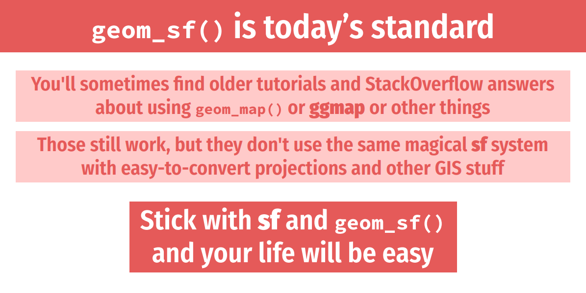
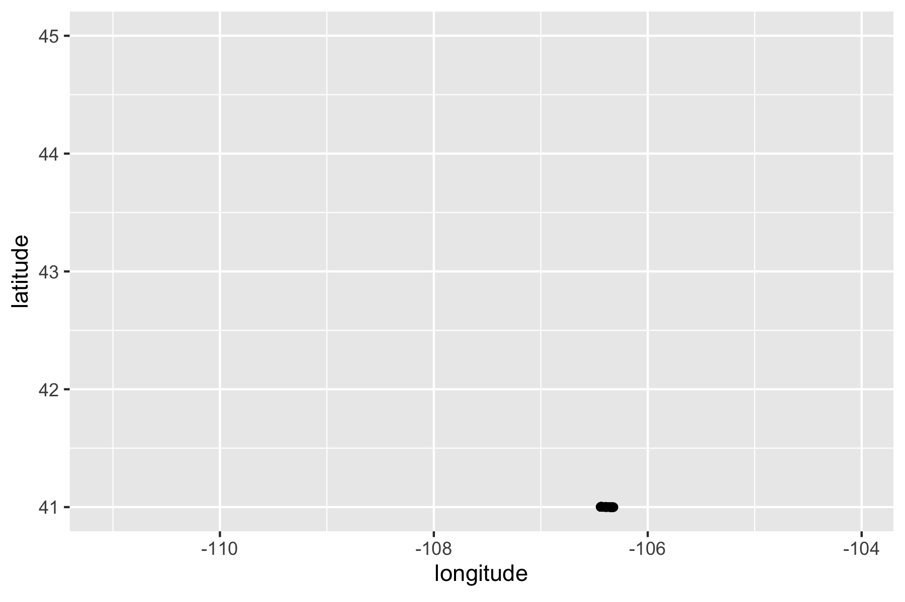

```{r}
#| echo: false
options(pillar.sigfig = 7)
```


### Always use sf data



[source](https://datavizs22.classes.andrewheiss.com/slides/12-slides.pdf)

### Geometry Type {.inverse}

#### `POLYGON`

. . .

```{r}
library(sf)
library(tidyverse)

wyoming <-
  read_sf("data/wyoming.geojson")

wyoming
```

---

```{r}
ggplot() +
  geom_sf(data = wyoming)
```

#### `POINT`

. . .

```{r}
wyoming_one_ev_station <-
  read_sf("data/wyoming-one-ev-station.geojson")

wyoming_one_ev_station
```

---

```{r}
ggplot() +
  geom_sf(data = wyoming) +
  geom_sf(data = wyoming_one_ev_station)
```

#### `LINESTRING`

. . .

```{r}
wyoming_highway_30 <-
  read_sf("data/wyoming-highway-30.geojson")

wyoming_highway_30
```

---

```{r}
ggplot() +
  geom_sf(data = wyoming) +
  geom_sf(data = wyoming_highway_30)
```

#### `MULTIPOLYGON`

. . .

```{r}
#| echo: false
#| eval: false
fs::file_delete("data/rhode-island.geojson")

read_sf("data/BND_State_1997_spf_-1467871017424358584.geojson") |>
  summarize(geometry = st_combine(geometry)) |>
  write_sf(
    "data/rhode-island.geojson"
  )
```

```{r}
rhode_island <-
  read_sf("data/rhode-island.geojson")

rhode_island
```

---

```{r}
ggplot() +
  geom_sf(data = rhode_island)
```

#### `MULTIPOINT`

. . .

```{r}
wyoming_all_ev_stations <-
  read_sf("data/wyoming-all-ev-stations.geojson")

wyoming_all_ev_stations
```

---

```{r}
ggplot() +
  geom_sf(data = wyoming) +
  geom_sf(data = wyoming_all_ev_stations)
```

#### `MULTILINESTRING`

. . .

```{r}
wyoming_roads <-
  read_sf("data/wyoming-roads.geojson")

wyoming_roads
```

---

```{r}
ggplot() +
  geom_sf(data = wyoming) +
  geom_sf(data = wyoming_roads)
```

### Dimensions {.inverse}

---

```{r}
wyoming
```

::: {.notes}
Almost always XY

Z is altitude

M: "an M coordinate (rarely used), denoting some measure that is associated with the point, rather than with the feature as a whole (in which case it would be a feature attribute); examples could be time of measurement, or measurement error of the coordinates"

https://r-spatial.github.io/sf/articles/sf1.html#dimensions
:::

### Bounding Box {.inverse}

---

```{r}
rhode_island
```

---

```{r}
#| echo: false
rhode_island_bounding_box <-
  rhode_island |>
  st_bbox() |>
  st_as_sfc() |>
  st_sf() |>
  rename(geometry = st_as_sfc.st_bbox.rhode_island..)
```  

```{r}
rhode_island_bounding_box
```

---

```{r}
ggplot() +
  geom_sf(data = rhode_island) +
  geom_sf(
    data = rhode_island_bounding_box,
    color = "red",
    linewidth = 1,
    fill = NA
  )
```

### Coordinate Reference System (CRS) {.inverse}

---

```{r}
wyoming
```

---

```{r}
#| echo: false
wyoming_different_projection <-
  wyoming |>
  st_transform(5070)
```

```{r}
wyoming_different_projection
```

---

```{r}
wyoming |>
  ggplot() +
  geom_sf()
```

---

```{r}
wyoming_different_projection |>
  ggplot() +
  geom_sf()
```


### `geometry` Column {.inverse}

---

```{r}
wyoming
```

```{r}
#| echo: false
wyoming_coordinates <-
  wyoming |>
  st_coordinates() |>
  as_tibble() |>
  rename(longitude = X, latitude = Y) |>
  select(longitude, latitude)
```

. . .

```{r}
wyoming_coordinates
```

---

```{r}
wyoming_coordinates |>
  ggplot(
    aes(
      x = longitude,
      y = latitude
    )
  ) +
  geom_point()
```

---

```{r}
#| echo: false
#| eval: false
library(gganimate)

wyoming_coordinates_animated <-
  wyoming_coordinates |>
  mutate(row_number = row_number()) |>
  # slice(1:10) |>
  ggplot(
    aes(
      x = longitude,
      y = latitude,
      group = row_number
    )
  ) +
  geom_point() +
  transition_reveal(row_number)

animate(
  wyoming_coordinates_animated,
  height = 4,
  width = 6,
  units = "in",
  res = 300
)

anim_save("assets/wyoming-animated.gif")
```




### Your Turn {.your-turn}

```{r}
#| eval: false
#| echo: false
library(rnaturalearth)
library(tidyverse)
library(sf)

ne_countries(continent = "Africa") |>
  select(admin) |>
  arrange(admin) |>
  rename(country = admin) |>
  write_sf("data/africa.geojson")
```


- Run the following code in order to import an `sf` object called `africa`. 

. . .

```{r}
#| echo: true
#| eval: false

library(sf)

africa <-
  read_sf(
    "https://raw.githubusercontent.com/rfortherestofus/mapping-with-r-v2/refs/heads/main/data/africa.geojson"
  )
```

### Your Turn {.your-turn}

- Examine your object, ensuring you can identify its geometry type, dimensions, bounding box, coordinate reference system and `geometry` column.

- If you want to, try making a static map with the `geom_sf()` function from ggplot and/or an interactive map with the `mapview()` function from the {mapview} package.

### Learn More

https://r-spatial.github.io/sf/articles/sf1.html