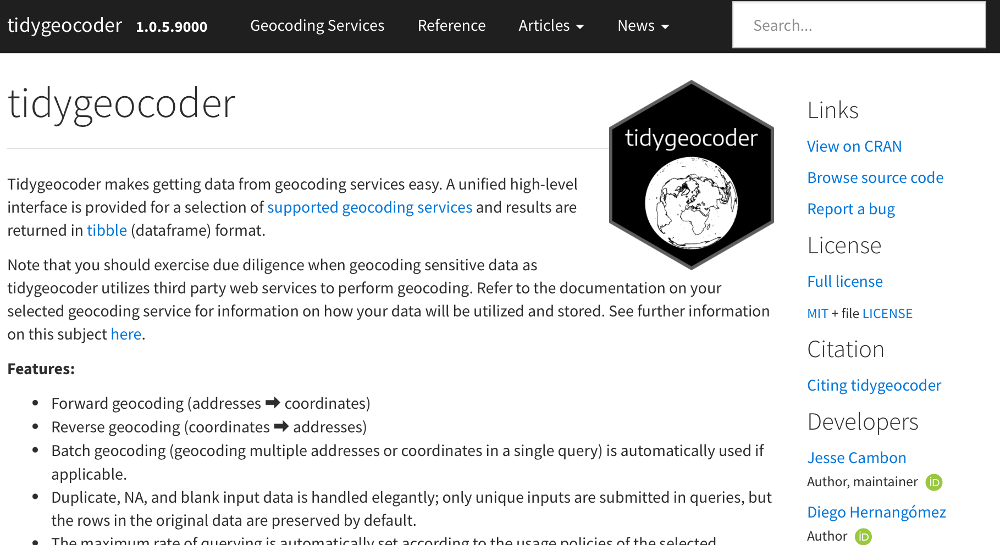

```{r}
#| echo: false
library(sf)
```

### {tidygeocoder}



### {tidygeocoder} {.inverse}

### Geocoding a Full Address

```{r}
library(tidyverse)

famous_places <-
  tribble(
    ~building                                                      ,
    ~address                                                       ,
    "White House"                                                  ,
    "1600 Pennsylvania Ave NW, Washington, DC 20500 United States" ,
    "Empire State Building"                                        ,
    "350 5th Ave, New York, NY 10118, USA"
  )
```

### Geocoding a Full Address

```{r}
library(tidygeocoder)

famous_places |>
  geocode(address)
```

### Geocoding a Full Address

```{r}
famous_places_sf <-
  famous_places |>
  geocode(address) |>
  st_as_sf(
    coords = c("long", "lat"),
    crs = 4326
  )
```

```{r}
famous_places_sf
```

---

```{r}
famous_places_sf |>
  mapview::mapview()
```

### Geocoding Services {.inverse}

::: {.notes}
Show getting API key from LocationIQ
:::

---

```{r}
us_and_uk_head_residences <-
  tribble(
    ~building                                                      ,
    ~address                                                       ,
    "White House"                                                  ,
    "1600 Pennsylvania Ave NW, Washington, DC 20500 United States" ,
    "Number 10"                                                    ,
    "10 Downing St, London SW1A 2AA, United Kingdom"
  )

us_and_uk_head_residences
```

---

```{r}
us_and_uk_head_residences |>
  geocode(address)
```

---


```{r}
#| code-line-numbers: "4"
us_and_uk_head_residences |>
  geocode(
    address,
    method = "iq"
  )
```

::: {.notes}
Both ArcGIS (https://location.arcgis.com/pricing/#geocoding) and Mapbox (https://www.mapbox.com/pricing) are paid for storing addresses
:::


---

```{r}
#| echo: false
us_and_uk_head_residences_v2 <-
  tribble(
    ~building                  ,
    ~address                   ,
    ~city                      ,
    ~state                     ,
    ~postal_code               ,
    ~country                   ,
    "White House"              ,
    "1600 Pennsylvania Ave NW" ,
    "Washington"               ,
    "DC"                       ,
    "20500"                    ,
    "United States"            ,
    "Number 10"                ,
    "10 Downing St"            ,
    "London"                   ,
    NA                         ,
    "SW1A 2AA"                 ,
    "United Kingdom"
  )
```

```{r}
us_and_uk_head_residences_v2
```

---

```{r}
us_and_uk_head_residences_v2 |>
  geocode(
    street = address,
    city = city,
    state = state,
    postalcode = postal_code,
    country = country
  )
```

::: {.notes}
Doesn't work for Number 10, which is transition to talking about `method` argument
:::

---

```{r}
#| code-line-numbers: "8"
us_and_uk_head_residences_v2 |>
  geocode(
    street = address,
    city = city,
    state = state,
    postalcode = postal_code,
    country = country,
    method = "iq"
  )
```

### Your Turn {.your-turn}

- Create a tibble with the following starter code for your home address:

. . .

```{r}
#| eval: false
#| output-location: default

library(tidyverse)

my_address <-
  tribble(
    ~address                 ,
    "Your address goes here"
  )
```

### Your Turn {.your-turn}

- Use the {tidygeocoder} package to geocode your address

- Turn the result into an `sf` object with `st_as_sf()` and plot it on a map with `mapview::mapview()` to make sure it worked

- Remember that if you want to use `method = "iq"` you'll need to sign up for a free LocationIQ account and create an API key

<!-- ### Learn More

Can also use mapboxapi: https://walker-data.com/mapboxapi/articles/geocoding.html -->